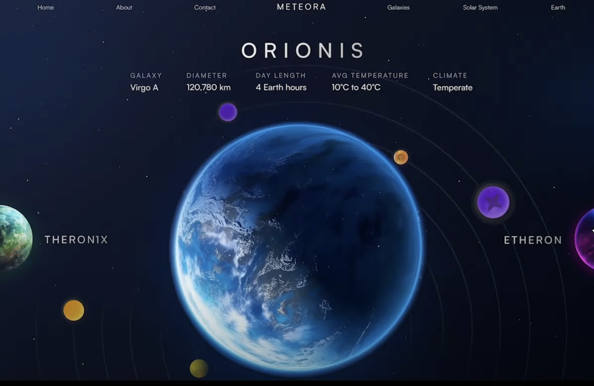
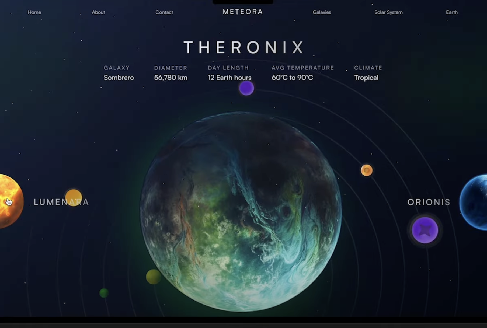
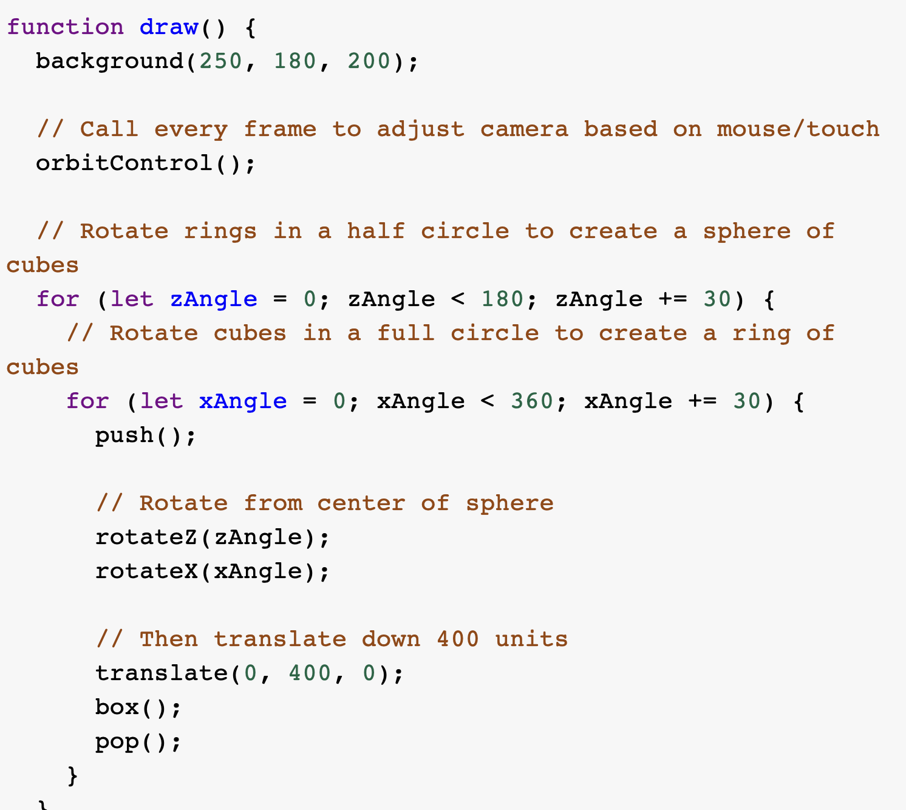
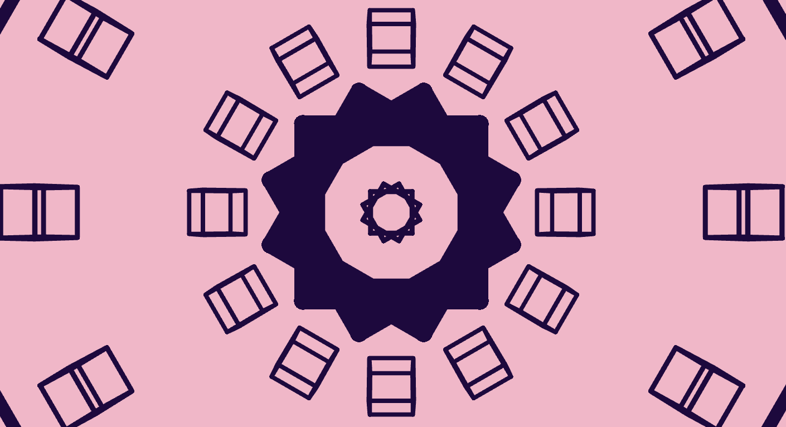

# Quiz-8
**##Imaging inpiration**

This imaging technique is user interactive. Cliking and mouse-dragging make both big and small sphere elements rotate in a camera perspective. I would like to apply this interactive technique to my project because it not only responds the reuirement of "incorporate mouse or keyboard inputs for animation" but it is a common inspiration for many web design works. Also, It is a good fit for the listed art works "Wheels of fortune" our group plan to work on.

**##Coding technique**

[Coding Technique reference](https://p5js.org/examples/3d-orbit-control/)
The artwork is an interactive 3D sketch. By clicking or draging the mouse, the camera orientation can be rotated along with mouse. By using mouse wheel to scroll, the shapes and elements can be zoomed in and out. The orbitContro() function can be applied as user interaction method, allowing users to drag elements by using mouse or touching screen to adjust camera orientation. The functions such as for (let Angle..Angle<..) and rotate(angle) for creating a group of rotated elements under the use of mouse interactive function.